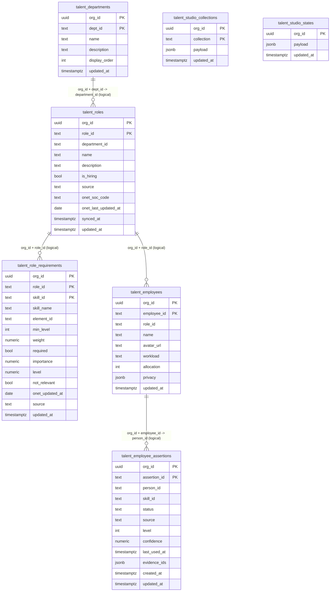

# Talent Studio Data Model (Supabase)

This document explains the current Talent Studio storage model in Supabase, including table purposes, primary keys, logical relationships, and migration notes from the legacy snapshot table.

## Scope

Applies to Talent Studio persistence implemented in:

- `lib/talentStudioStorage/supabase.ts`
- `data/talent_studio_state_migration.sql`
- `data/onet_roles_schema_patch.sql`

---

## ER Diagram

Notes:

- The relationships above are enforced by application logic and key matching, not by explicit PostgreSQL foreign key constraints in the current schema.
- O*NET synchronization writes into `talent_roles` and `talent_role_requirements` and then remaps employee `role_id` values to the synced O*NET role IDs.

---

## Table Purpose (Short Reference)

| Table | What it stores |
|---|---|
| `talent_departments` | Department taxonomy used to group roles |
| `talent_roles` | Role records (manual and O*NET sourced roles) |
| `talent_role_requirements` | Per-role required skills and proficiency metadata (including O*NET metrics) |
| `talent_employees` | Employee profiles and role assignment (`role_id`) |
| `talent_employee_assertions` | Employee skill claims/evidence entries by `person_id` + `skill_id` |
| `talent_studio_collections` | Non-core datasets persisted as keyed JSON payloads (`resources`, `plans`, `tasks`, `taskRequirements`, `crewBlueprints`, etc.) |
| `talent_studio_states` | Legacy one-row JSON snapshot table used for migration/backfill only |

---

## Current Runtime Read/Write Behavior

Talent Studio runtime persistence uses normalized tables + keyed collections:

- Reads:
  - `talent_departments`
  - `talent_roles`
  - `talent_role_requirements`
  - `talent_employees`
  - `talent_employee_assertions`
  - `talent_studio_collections`
- Writes:
  - Same six tables above
- Not used at runtime:
  - `talent_studio_states` (legacy backfill source only)

---

## Should `talent_studio_collections` be deleted?

No. It is actively used by runtime load/save paths in `lib/talentStudioStorage/supabase.ts`.

If deleted, Talent Studio loses persisted payload-backed datasets such as:

- `resources`
- `plans`
- `outbox`
- `permits`
- `tasks`
- `taskRequirements`
- `permitSchemas`
- `crewBlueprints`
- `projects`
- `personPermits`
- `complianceTrainings`
- `teamBuilds`
- `publishedConfigs`

---

## Should `talent_studio_states` be deleted?

Not required for runtime. It is a legacy table used by migration SQL as a backfill source.

Safe approach:

1. Confirm all required data has been migrated and validated in normalized tables.
2. Keep a backup/export of `talent_studio_states`.
3. Drop only after explicit approval and rollback readiness.

---

## Employee Recovery Principle with O*NET Roles

To restore historical employees while keeping O*NET as source of truth for roles/requirements:

1. Ensure O*NET roles exist in `talent_roles`.
2. Upsert employee rows into `talent_employees` using current O*NET role IDs.
3. Rebuild `talent_employee_assertions` using skill IDs that exist in `talent_role_requirements` (avoid legacy bucket-only skill IDs).

This keeps employee data connected to current role/skill topology.

